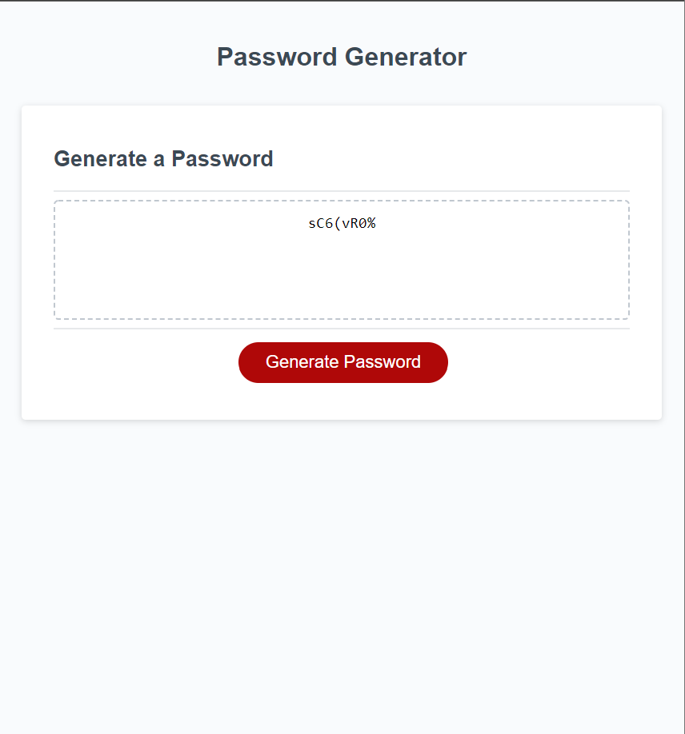

# Javascript Password Generator

## Description
This project will demonstate creating an application that an employee can use to generate a random password based on criteria they've selected. This app will run in the browser, and will feature dynamically updated HTML and CSS powered by JavaScript code that you write.

## Usage

- When you click the button to generate password, you will be presented with a series off prompts for password criteria.

- Once prompted for password criteria
then you will select which criteria to include in the password.

- Then you will be prompted to choose length of password.

- Must choose at least a length 8 characters and no more than 128 characters.

- The you will confimrm  whether or not to include lowercase, uppercase, numeric, and/or special characters.

- An answer to each prompt
should validate my input and at least one character type should be selected.

- When all promts are answered then a password is generated that matche the criteria that is selected.

- Generated password is then displayd in alert or written on page, in this project it will be writtent on page.

Application deployed at live URL.

Application loads with no errors.

Application GitHub URL submitted.

GitHub repository that contains application code.

<a href="https://tajajones2.github.io/Javascript_Password_Generator/">Click here for live link!</a>

    

    

## Credits

I credit myself, Taja Jones, for completing a password generator via JavaScript.

## License
MIT License

Copyright (c) 2022 Taja Jones

Permission is hereby granted, free of charge, to any person obtaining a copy
of this software and associated documentation files (the "Software"), to deal
in the Software without restriction, including without limitation the rights
to use, copy, modify, merge, publish, distribute, sublicense, and/or sell
copies of the Software, and to permit persons to whom the Software is
furnished to do so, subject to the following conditions:

The above copyright notice and this permission notice shall be included in all
copies or substantial portions of the Software.

THE SOFTWARE IS PROVIDED "AS IS", WITHOUT WARRANTY OF ANY KIND, EXPRESS OR
IMPLIED, INCLUDING BUT NOT LIMITED TO THE WARRANTIES OF MERCHANTABILITY,
FITNESS FOR A PARTICULAR PURPOSE AND NONINFRINGEMENT. IN NO EVENT SHALL THE
AUTHORS OR COPYRIGHT HOLDERS BE LIABLE FOR ANY CLAIM, DAMAGES OR OTHER
LIABILITY, WHETHER IN AN ACTION OF CONTRACT, TORT OR OTHERWISE, ARISING FROM,
OUT OF OR IN CONNECTION WITH THE SOFTWARE OR THE USE OR OTHER DEALINGS IN THE
SOFTWARE.

